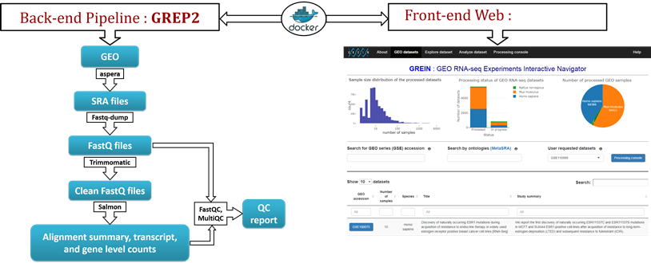

 <h2>
**GREIN** : GEO RNA-seq Experiments Interactive Navigator

**GREIN** is an interactive web platform that provides user-friendly options to explore and analyze [GEO](https://www.ncbi.nlm.nih.gov/geo/) RNA-seq data. The Gene Expression Omnibus (GEO) is a public repository of gene expression data that hosts more than 6,000 RNA-seq datasets and this number is significantly growing. Most of the samples are deposited in raw sequencing format which needs to be downloaded and processed. With an aim to transform all these datasets in an analysis-ready format, we are constantly processing all available RNA-seq samples of human, mouse, and rat from GEO using an R-based pipeline, [GREP2](https://github.com/uc-bd2k/GREP2) (GEO RNA-seq Experiments Processing Pipeline). This pipeline simultaneously downloads and processes RNA-seq raw sequencing files available in GEO. A brief outline of the pipeline workflow is described below:  

 <h3>GREP2 : GEO RNA-seq Experiments Processing Pipeline</h3> 

The whole pipeline consists of two sub-pipelines: downloading and processing. Both the pipelines are simultaneously running on a [docker](https://hub.docker.com/r/ucbd2k/grein) conatiner. The pipeline diagram is shown below:  
  
  

  
---
#### Processing pipeline

* Retrieve metadata for a given GEO series accession using Bioconductor package [GEOquery](http://bioconductor.org/packages/release/bioc/html/GEOquery.html). We also download metadata file for the given data set from [SRA](https://www.ncbi.nlm.nih.gov/sra) to get the corresponding run information and merge both these metadata files by sample names. We keep samples with library strategy `RNA-seq` only.

* For each of the samples in a data set, download the associated run files from SRA database using `ascp` utility of [aspera connect](http://asperasoft.com/).

* For each sample in a data set, we generate FastQ files from each SRA file using [SRA Toolkit](https://www.ncbi.nlm.nih.gov/sra/docs/toolkitsoft/).

* Get rid of the adapter sequences if necessary using [Trimmomatic](http://www.usadellab.org/cms/?page=trimmomatic).

* Quality control (QC) reports are generated for each of the FastQ files using [FastQC](https://www.bioinformatics.babraham.ac.uk/projects/fastqc/).

* We then run [Salmon](https://combine-lab.github.io/salmon/) to quantify transcript abundances for each sample. These transcript level estimates are then summarized to gene level using [tximport](https://bioconductor.org/packages/release/bioc/html/tximport.html). We use `lengthScaledTPM` option in the summarization step which gives estimated counts scaled up to library size while taking into account for transcript length. We obtained gene annotation for Homo sapiens (GRCh38), Mus musculus (GRCm38), and Rattus norvegicus (Rnor_6.0) from Ensemble (release-91).

* All the information from [FastQC](https://www.bioinformatics.babraham.ac.uk/projects/fastqc/) and [Salmon](https://combine-lab.github.io/salmon/) quantification folders are then combined to produce a single QC report using [MultiQC](http://multiqc.info/). 
  
  
--------------

<h4>Citation</h4>
Please cite GREIN by: 
* Al Mahi,N. *et al* (2018) GREIN: An interactive web platform for re-analyzing GEO RNA-seq data. bioRxiv 326223; doi: https://doi.org/10.1101/326223

-------------
<h4>Code</h4>
Source code of GREIN is available in [GitHub](https://github.com/uc-bd2k/GREIN). You can post any comments, suggestions, or bug reports [here](https://github.com/uc-bd2k/GREIN/issues).

  