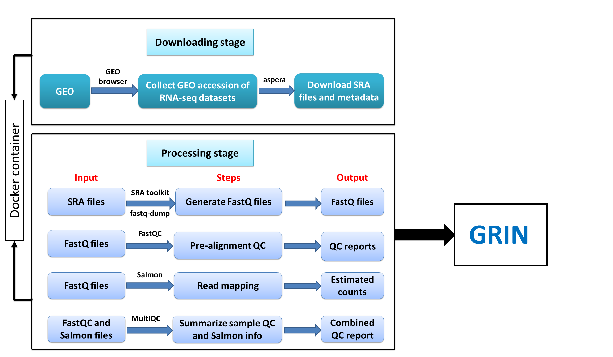

 <h2>
A brief overview of the pipeline for downloading and processing GEO RNA-seq data sets</h2> 

The whole pipeline consists of two sub-pipelines: downloading and processing pipeline. Both of these are simultaneously running on a [docker](https://www.docker.com/) conatiner. The pipeline diagram is shown below: 

### Downloading pipeline
* Download metadata for a given GEO study accession using bioconductor package [GEOquery](http://bioconductor.org/packages/release/bioc/html/GEOquery.html). We also download the metadata file for the data set (`RunInfo.csv`) from [SRA](https://www.ncbi.nlm.nih.gov/sra) to get the corresponding run information and merge both these metadata files by sample names. 
* For each of the samples in a data set, download the associated run files (`.sra files`) from SRA database using [aspera](http://asperasoft.com/). All the downloaded files are stored in local repository until processed. 

### Processing pipeline

* For each sample in a data set, we generate FastQ files from each SRA file using [SRA Toolkit](https://www.ncbi.nlm.nih.gov/sra/docs/toolkitsoft/).

* Quality control (QC) reports are generated for each of the FastQ files using [FastQC](https://www.bioinformatics.babraham.ac.uk/projects/fastqc/).

* We then run [Salmon](https://combine-lab.github.io/salmon/) to quantify transcript abundances for each sample. These transcript level estimates are then summarized to gene level using [tximport](https://bioconductor.org/packages/release/bioc/html/tximport.html). We use `lengthScaledTPM` option in the summarization step which gives estimated counts scaled up to library size while taking into account for transcript length. 

* All the information from [FastQC](https://www.bioinformatics.babraham.ac.uk/projects/fastqc/) and [Salmon](https://combine-lab.github.io/salmon/) quantification folders are then combined to produce a single report using [MultiQC](http://multiqc.info/). 

