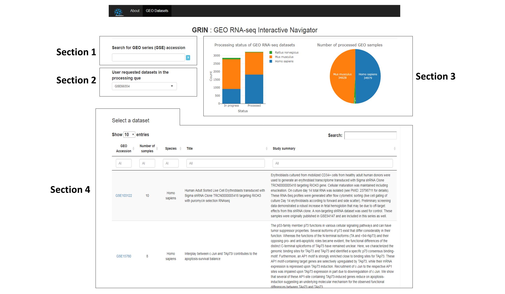
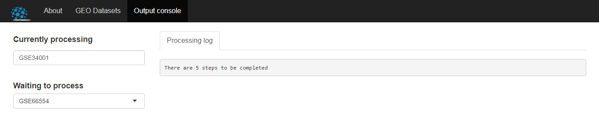

#Landing page (GEO datasets)

To illustrate the usability and efficacy of GRIN, we will walk through the available options for exploring and analyzing data sets with an example. GRIN is a platform independent web application. All you need is to open a web browser and type this url [https://www.ilincs.org/apps/GRIN/](https://www.ilincs.org/apps/GRIN/) in the address bar which will load the following landing page with four sections as shown below :

  
###Section 1 
This section provides the option to process your GEO dataset of interest if it is not already processed. You can search for a GEO series accession to see if it exists in the dataset table (Section 4). If not, then `Start processing` button will appear right below this box and you can initialize the process by clicking this button which will take you to the `Processing console` window as shown below:

You will see your data set id at the bottom of the `Waiting to process` menu. This window also shows the logs of the currently processing dataset requested by a user. A single server processing pipeline is continuously running and processing datasets whenever requested. This pipeline is dedicated to process the user requested datasets only. Depending on the size of the data and queue, the requested data sets are automatically uploaded to the portal as soon as they are processed.  
  
###Section 2
The user requested data sets are shown in this section. If you have already requested for a data set to process, then you will be able to see your data set id (GEO series accession) once you refresh the web page. You can also see the status of the processing queue by pressing the `Processing console` button. 
  
###Section 3
This section provides information regarding the total number of data sets already processed or waiting to be processed. The pie chart shows the numebr of processed human, mouse, or rat samples by our pipeline.
  
###Section 4
You can see the list of processed data sets with additional information in section 4. Two types of search options are available in this table. Search box at the top-right of the table lets a user to search anything in this table. Other search boxes at the top of each column enables column-wise searching. **You can click the GEO accession in the first column to start exploring a dataset**.
    
    
#Explore dataset

Let us start by searching `GSE60450` either at the top-right or first column's search box in the dataset table. If you click `GSE60450`, it will take you to the `Explore dataset` tab. This experiment was conducted to examine the change in expression profiles between luminal and basal cells in mouse mammary glands of virgin, pregnant, and lactating mice. The data set is available in GEO as [GSE60450](https://www.ncbi.nlm.nih.gov/geo/query/acc.cgi?acc=GSE60450).
    
##Description
This tabpanel provides descriptive information including study link, number of GEO samples, number of SRA runs, title, and study summary of the corresponding dataset.

##Metadata
GEO metadata contains a lot of information, although not all of these information are useful for analysis or visualization purpose. Besides the full metadata, we provide a filtered version of the metadata. We filter metadata based on the follwoing criteria:  
1. Columns that contain a single value.  
2. Columns with incoherent information regarding analysis and visualization such as dates, time, download path and so on.  
`GSE60450` has two cell types and three developmental stages and each combination has two biological replicates.  

##Counts table
This table shows genewise estimated read counts (rounded to the nearest integer) for each sample. We use [Salmon](https://combine-lab.github.io/salmon/) (version : 0.8.2) to quantify transcript abundances for each sample. These transcript level estimates are then summarised to gene level using [tximport](https://bioconductor.org/packages/release/bioc/html/tximport.html) (version : 1.6.0) which gives estimated counts scaled up to library size while taking into account for transcript length. We use `EnsDb.Hsapiens.v86`, `EnsDb.Mmusculus.v79`, `EnsDb.Rnorvegicus.v79` for Homo sapiens, Mus musculus, and Rattus norvegicus to extract transcript information.  

  
##QC report
After running [FastQC](http://www.bioinformatics.babraham.ac.uk/projects/fastqc/) (version :  0.11.4) and [Salmon](https://combine-lab.github.io/salmon/), we generate a combined quality control report of all the samples using [MultiQC](http://multiqc.info/) (version : 1.2). This downloadable report contains information regarding read mapping and quality scores of the FastQ files. A sample QC report is attached [here](sample_qc.html). In the general statistics table, each sample corresponds to two rows, the first one for the Salmon read mapping and the second one for FastQC.  

##Visualization
This section provides access to four different types of interactive exploratory plots. These plots are important in order to uncover underlying relationship of the samples and gain deeper insight of the data structure. 

###Correlation plot

Sample-wise Spearman's rank correlation plot:  

  
The overall sample-to-sample correlation is quite high, although basal or luminal cells have higher within group correlation compared to between group correlation.  

###Density plot
Distribution of the data on the $log_2 (count\:per\:million)$ scale is shown in the density plot:  

  

###Heatmap

Heatmap is a popular way to visualize hierarchical clustering of gene expression data. 
We display heatmap of the top most highly variable genes (sorted by median absolute deviation values and data is centered to the mean) in this section. User can pick any number of genes to cluster genes and samples based on any of the three methods: Pearson correlation, Euclidean distance, or group by properties. Two types of heatmaps are available:    

1. Fit in screen: A complete picture that fits to the window without the gene symbols.
  
  
2. Scrollable: Shows the gene symbols.
  

###Principal component analysis

1. Interactive 2-D PCA plot: Scatter plot matrix of the first five principal components in $log_2\:of\: \:counts\:per\:million$ scale. 

  

2. Interactive 3-D PCA plot: An interactive three dimensional plot of the principal components.  

  

#Analyze dataset

##Power analysis

An action button `Analyze` is attached in the left panel of each section of `Explore dataset` tab. Once you click the button, it will take you to the `Analyze dataset` tab. The very first section in this tab is the `Power analysis`. This section is dedicated to assist users in power analysis which is an essential step in designing an RNA-seq experiment with a goal to achieve the desired power to detect differentially expressed genes.  

###Power curve

We use bioconductor package [RNASeqPower](http://bioconductor.org/packages/release/bioc/html/RNASeqPower.html) to calculate power using the following parameters:

1. Biological coefficient of variation calculated as the squared root of common dispersion (We use bioconductor package [edgeR](https://bioconductor.org/packages/release/bioc/html/edgeR.html) to calculate common dispersion).
2. Number of samples. Default is the sample size of the data in use.
3. Fold change as the effect size. The default value is 2.
4. Level of significance or alpha. The default value is 0.05.
5. Average sequencing depth in million. The default is calculated as the average column sums in million.

  
  
###Detectability of genes

The plot of biological coefficient of variation (BCOV) vs. average log(counts per million) gives an idea of how the detectability of genes as differentially expressed (DE) may vary based on their BCOV. The line of detectability (LOD) is the estimated values of BCOV for different sequencing depths. Genes above this line have lower chances to be detected as differentially expressed compared to the genes below the line. Basically, LOD tells us that even if we increase the depth of sequencing to a very high number, genes above this line will not have enough power to be detected as DE.  
You can modify the parameters as per your interest. Also, you can search for a gene or hovering over the points will display gene symbols. 

  
  
  
##Create a signature
This section begins with selecting a variable of interest to test for differential expression between the groups of this variable. We select the variable `developmental stage`. Depending on the number of available properties and levels, three different types of comparisons are available: two group without covariate, two group with covariate, and multi group without covariate. Here, we have three groups available for the selected variable `developmental stage` and we test for differential expression between pregnant and lactating groups. We choose `2 day lactation` as the experimental group and `18.5 day pregnancy` as the control group. This will generate a signature data table as shown below:  

  

The analysis pipeline starts by filtering genes with very low counts. Genes that have CPM values of more than 1 in at least the minimum number of samples in any of the comparison groups are kept for downstream analysis. We apply trimmed mean of M values (TMM) for normalizing libraries which is a built-in normalization method in [edgeR](https://bioconductor.org/packages/release/bioc/html/edgeR.html). A design matrix is constructed based on the selected variable and groups. We use genewise negative binomial generalized log-linear models with quasi-likelihood tests and genewise exact tests from bioconductor package [edgeR](https://bioconductor.org/packages/release/bioc/html/edgeR.html) to calculate differential expression between groups with and without covariates respectively. P-values are adjusted for multiple testing correction using Benjamini-Hochberg method. A gene is considered up-regulated in the `2 day lactation` group if $log_2\:fold\:change$ (Log_FoldChange) is positive and 
a gene is down-regulated if $log_2\:fold\:change$ is negative.  

####

We also visualize the top differentially expressed genes in a heatmap to show the change in relative expression of the genes. User can select to show the heatmap across all the samples or the comparison samples only.  

  

As a part of NIH [LINCS](http://www.lincsproject.org/) program, we provide with an option to upload signature directly to [iLINCS](http://www.ilincs.org/). iLINCS (Integrative LINCS) is an integrative and user-friendly web platform with a number of tools for analysis of LINCS and non-LINCS data and signatures. User can upload or select a signature, find concordant signatures, and analyze them to identify meaningful biological pathways.  

  
  
##User specific design
In the `Create a signature` section, user does not have the option to select specific samples from each group or reorganize the samples within groups. For example, it is not possible to compare lactating and pregnant samples from the basal population only. The `User specific design` section is an extension of the previous section. It provides the flexibility to reconstruct the experimental design by selecting any samples for both experimental and control groups. 

###Metadata
After selecting the variable of interest and type of comparison, user can choose samples from the drop down menus of both experimental and control groups. When you select the groups, an additional variable (`selected groups`) will be created on the fly to show the selected samples corresponding to the two groups. After forming the design table, you can generate signature by clicking the `Generate signature` button.  

  

###Signature
Once you click the `Generate signature` button, it will take you the `Signature` tab. similar to the `Create a signature` tab, you can visualize the top DE genes in a heatmap, upload the signature to iLINCS, and download the signature table. 

  

### Create a table to show the tools and R packages used in pipeline and GRIN with reference.
